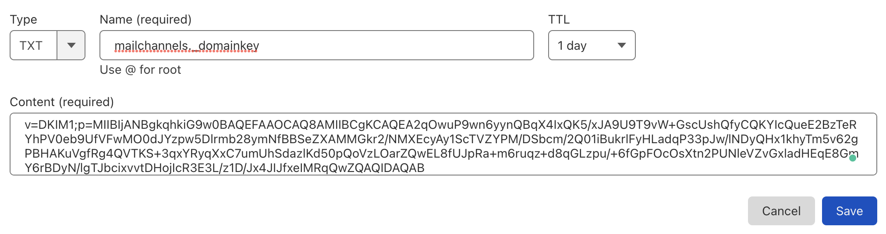

# Cloudflare + MailChannels Email Sending with DKIM

MailChannels [allows free email sending](https://blog.mailchannels.com/mailchannels-enables-free-email-sending-for-cloudflare-workers-customers) using a Cloudflare Worker. This code adapts the example provided in the article to implement DKIM signing. Official documentation on how to sign messages with DKIM is available [here](https://mailchannels.zendesk.com/hc/en-us/articles/7122849237389). 

## Setup

Before you start, make sure to set up Wrangler as explained [here](https://developers.cloudflare.com/workers/wrangler/get-started/).

We'll need to generate keys and a DNS record, which we can do with the steps in [this tutorial](https://www.mailhardener.com/kb/how-to-create-a-dkim-record-with-openssl).

### Generate the Private Key

To generate a private key and upload it to the worker, run the following command:

```sh
openssl genrsa 2048 | tee priv_key.pem | openssl rsa -outform der | openssl base64 -A | wrangler secret put DKIM_PRIVATE_KEY
```

The parts of this command:

`openssl genrsa 2048` generates a 2048-bit RSA key. The output is passed to

`tee priv_key.pem`, which writes the key to the `priv_key.pem` file, and passes the key to

`openssl rsa -outform der | openssl base 64 -A`, which converts the key from PEM format to DER format, then base64 encodes it (this essentially removes the header from the PEM formatted key). The output is finally passed to 

`wrangler secret put DKIM_PRIVATE_KEY`, which adds it as a secret to our Cloudflare Worker.

### Create the DNS Record

Now, we need to add the public key to a TXT record. Run the following command:

```sh
echo -n "v=DKIM1;p=" > record.txt && openssl rsa -in priv_key.pem -pubout -outform der | openssl base64 -A >> record.txt
```

This creates a public key from the private key (`openssl rsa -in priv_key.pem -pubout -outform der`), encodes it in base64 (`openssl base 64 -A`), and finally writes it to the `record.txt` file.

Copy the contents of the `record.txt` file and add it as a `TXT` record to your domain.


### Updating the Code

Find these lines in [`src/index.ts`](https://github.com/maggie-j-liu/mail/blob/main/src/index.ts):
```ts
            to: [
              {
                email: "", // add your to email here
              },
            ],
```

```ts
            dkim_domain: "", // add your domain
```

```ts
        from: {
          email: "", // add your from email here
        },
```

and add in your `to` and `from` email addresses, as well as the domain you are sending from.

## Running

Run `wrangler dev` or `wrangler publish`, and you should be able to test it out!
